# IPL Data Analysis

## Project Overview
This project analyzes IPL match and ball-by-ball data using **Python, Pandas, NumPy, and Matplotlib**.

The goal is to uncover insights about:
- Most successful teams
- Toss impact on match results
- Top batters and bowlers
- Strike rates and economy rates
- Venue performance
- Match scoring trends

---

## Tech Stack

- Python
- Pandas
- NumPy
- Matplotlib
- Jupyter Notebook

---

## Dataset

Dataset Source:

https://www.kaggle.com/datasets/sankha1998/ipl2023/data

Files Used:
- `each_match_records.csv`
- `each_ball_records.csv`

---

## Analysis Performed

### 1. Most Successful Team
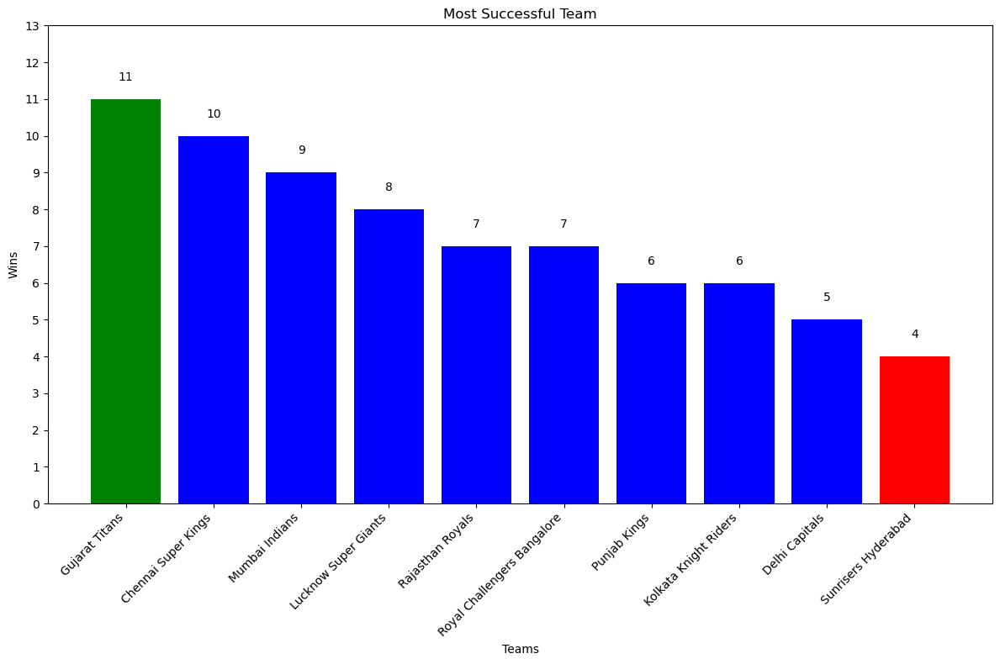

### 2. Impact of Toss on Match Result
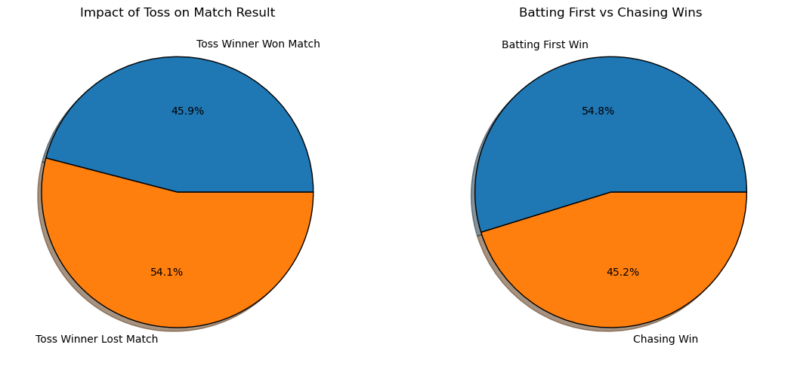

### 3. Most Player of the Match Awards
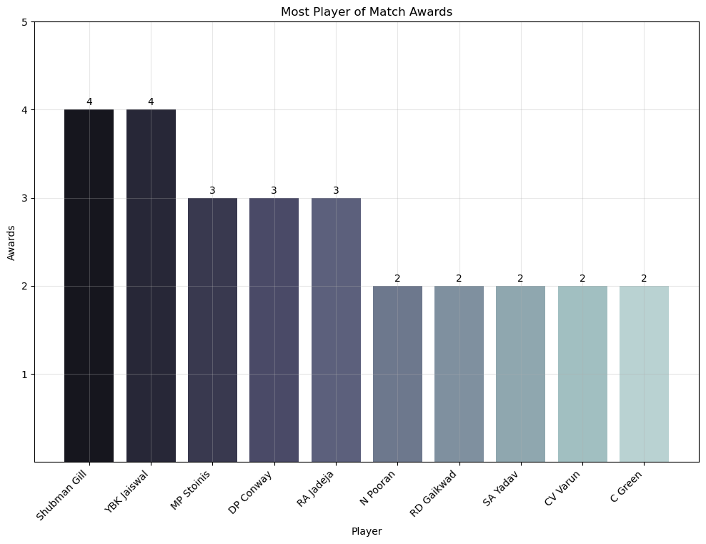

### 4. Top Run Scorers
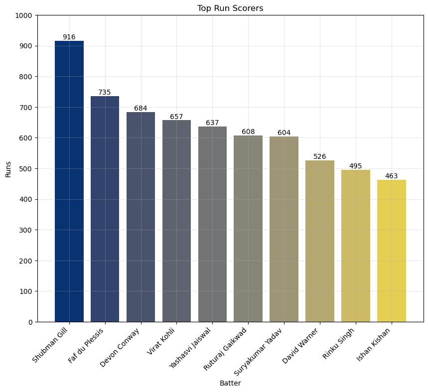

### 5. Runs vs Balls Faced
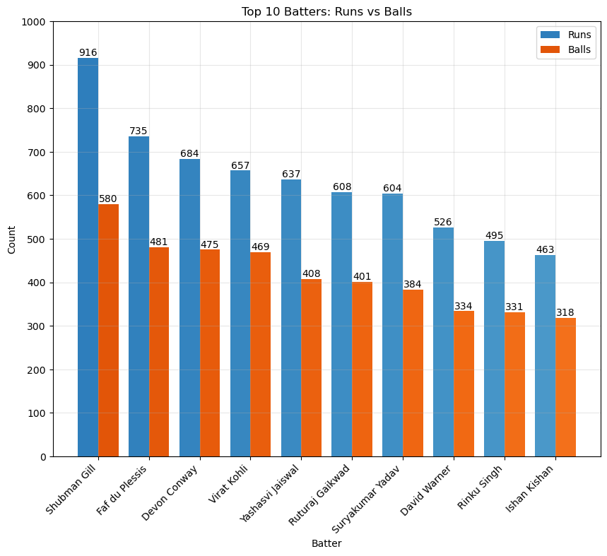

### 6. Most Sixes
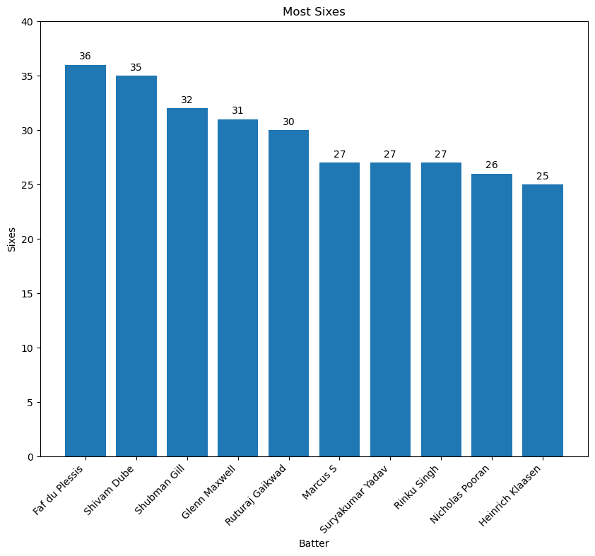

### 7. Most Fours
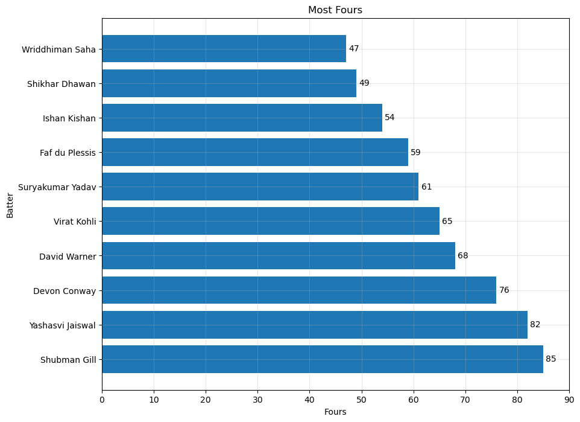

### 8. Best Strike Rate (Minimum 300 Balls)
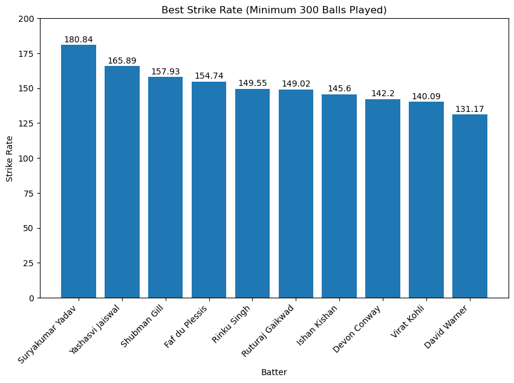

### 9. Top Wicket Takers
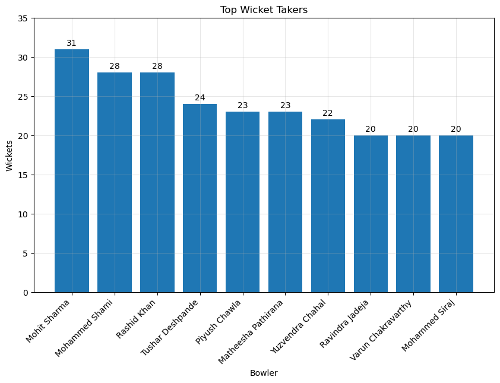

### 10. Best Economy Rate
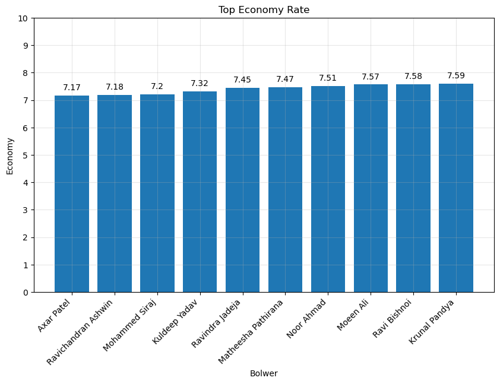

### 11. Venue Analysis
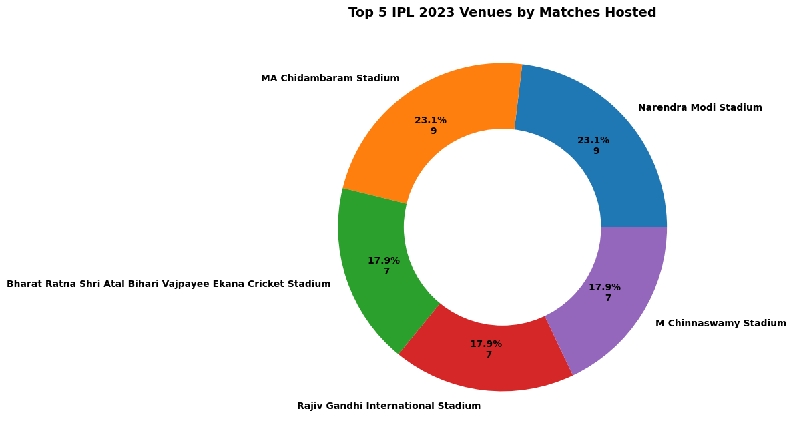

### 12. Total Runs Scored Match by Match
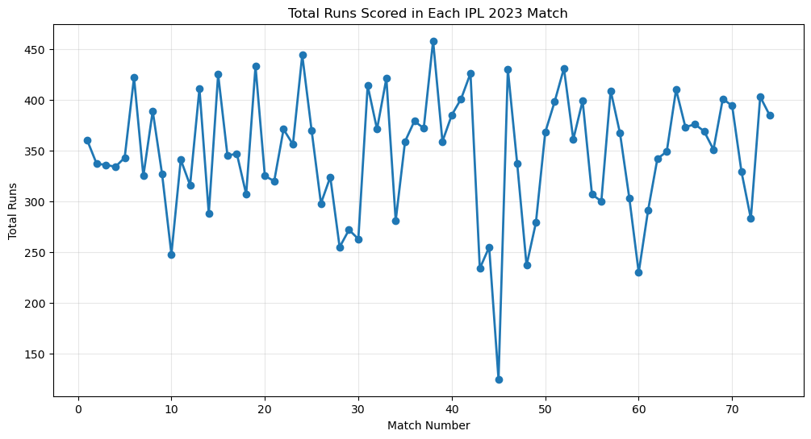

---

## Project Structure

```text
IPL-Data-Analysis/
│
├── data/
│   ├── each_match_records.csv
│   └── each_ball_records.csv
│
├── images/
│   └── *.png
│
├── IPL_Data_Analysis.ipynb
└── README.md
```


## Author

Brijesh Raval
